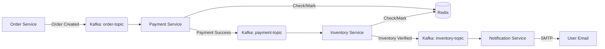

# 🛍️ Order Management System (OMS)

[](https://www.oracle.com/java/)
[](https://spring.io/projects/spring-boot)
[](https://kafka.apache.org/)
[](https://www.docker.com/)

A high-performance, **event-driven microservices architecture** designed to handle complex order processing, payment verification, inventory management, and automated user notifications.

---

## 🏗️ Architecture Overview

The system follows a reactive, asynchronous flow powered by **Apache Kafka**, ensuring high decoupling and fault tolerance.



### 📦 Services Breakdown
-   **Order Service:** Orchestrates the incoming customer requests and initiates the lifecycle.
-   **Payment Service:** **Idempotent** consumer that handles transaction processing via Redis.
-   **Inventory Service:** **Idempotent** stock management that ensures atomic fulfillment.
-   **Notification Service:** Real-time email delivery system using JavaMailSender with SMTP integration.
-   **Common Lib:** Shared library for events, DTOs, and the **Idempotency Engine**.

---

## 🛠️ Tech Stack

-   **Backend:** Java 17, Spring Boot 3.2.0
-   **Messaging:** Apache Kafka (KRaft Mode)
-   **Caching/Idempotency:** Redis 7.0
-   **Build Tool:** Gradle 8.5 (Multi-Project Build)
-   **Containerization:** Docker & Docker Compose
-   **Observability:** Redpanda Console (Kafka UI)
-   **Security:** Environment-based secret management (`.env`)

---

## 🔥 Key Features
-   **Event-Driven & Reactive:** Asynchronous communication for massive scalability.
-   **Redis Idempotency:** Custom-built `IdempotencyService` to ensure exactly-once processing across service boundaries.
-   **SMTP Notifications:** Automated real-world email confirmations for end-users.
-   **Self-Healing:** Built-in Kafka and Redis retries for high availability.
-   **Infrastructure-as-Code:** One-click deployment with Docker Compose.

---

## 🚀 Quick Start

Ensure you have **Docker Desktop** installed and running.

### 1. Clone & Configure
Create a `.env` file in the `notification-service` folder:
```env
gmail_password=your_16_digit_app_password
```

### 2. Launch Infrastructure
Run the following command in the root directory:
```bash
docker-compose up --build
```

### 3. Place an Order
Trigger the system-wide flow with a simple REST call:
```bash
curl -X POST http://localhost:8081/users/orders \
     -H "Content-Type: application/json" \
     -d '{
           "orderId": "ORD-12345",
           "userId": "USER-6789",
           "userEmail": "customer@example.com"
         }'
```

---

## 📊 Monitoring & Debugging


-   **Service Ports:**
    -   Order Service: `8081`
    -   Payment Service: `8082`
    -   Inventory Service: `8083`
    -   Notification Service: `8084`

---

## 🛡️ Security Features
-   **Multi-Stage Docker Builds:** Optimized for minimal image size and attack surface.
-   **Secret Injection:** Securely handles sensitive SMTP credentials via Docker Environment variables.
-   **Type-Safe Deserialization:** Leverages `ErrorHandlingDeserializer` to provide robust JSON processing across service boundaries.

---
Developed with ❤️ by Manpreet Singh
